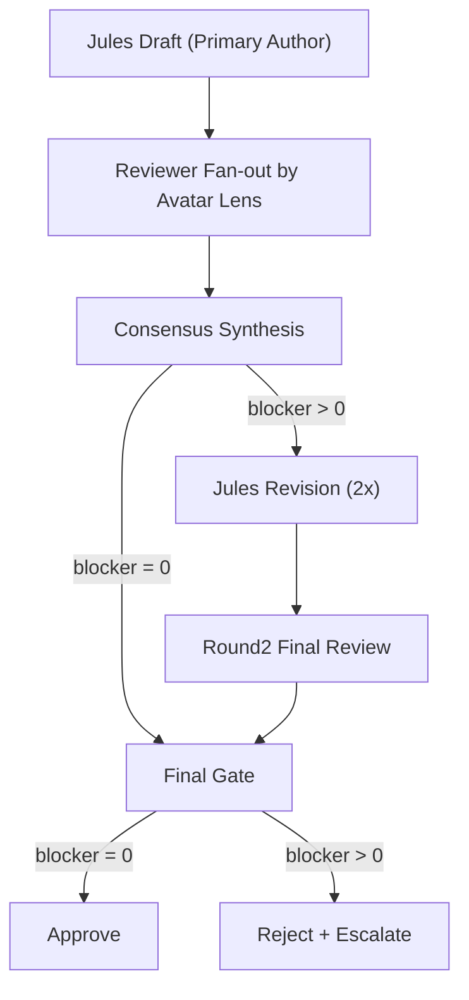

# DonggriCompany

DonggriCompany는 로컬 우선 AI 오케스트레이션 시스템입니다.

- 다중 에이전트 협업 실행
- 프로젝트 단위 태스크/리뷰/보고 파이프라인
- Decision Inbox 기반 승인 흐름
- Docker 운영 지원

## 1. 현재 운영 정책(핵심)
- 회사팩 기본값: `development`
- 동그리팩 적용: 명시 팩이 없을 때 텍스트 라우팅으로 `donggri` 자동 선택 가능
- 명시 팩 우선순위 유지: `workflow_pack_key`가 있으면 항상 명시값 우선
- 자동 라우팅으로 선택된 팩은 `officePackHydratedPacks`에 기록

## 2. Jules 중심 Avatar 2x 리뷰 파이프라인
- Jules는 `primary_author`
- 나머지 아바타는 `reviewer`
- 리뷰어는 최대 3명 자동 fan-out
- 리뷰 라운드는 최대 2회



### 리뷰 계약(필수 필드)
- `pass1`
- `pass2(counter-check)`
- `final_verdict`
- `confidence`
- `blocking_items`

## 3. 캐릭터별 설정(`workflow_profile`)
에이전트 생성/수정 시 아래 필드를 사용합니다.

```json
{
  "role": "primary_author | reviewer",
  "review_lenses": ["security", "performance", "ux"],
  "two_pass_required": true,
  "max_review_rounds": 2
}
```

### 기본값
- Jules: `primary_author`, `two_pass_required=true`, `max_review_rounds=2`
- 기타: `reviewer`, `two_pass_required=true`
- 레거시 에이전트: 런타임 기본값 주입

## 4. 한글 깨짐(모지바케) 대응
- CLI 스트림 정규화에 Windows 인코딩 fallback(euc-kr) 적용
- 서브태스크 제목 저장/조회 모두 정규화
- 깨진 제목 패턴(`?쒕툕...`) 자동 복구
- 응답 직전(display) 방어선 추가

## 5. 로컬 실행 (PowerShell)
### 5.1 설치
```powershell
git clone https://github.com/sheryloe/DonggriCompany.git
Set-Location .\DonggriCompany
corepack enable
corepack pnpm install
```

### 5.2 환경 변수
```powershell
Copy-Item .\.env.example .\.env
```
필수 예시:
- `OAUTH_ENCRYPTION_SECRET`
- `API_AUTH_TOKEN`
- `INBOX_WEBHOOK_SECRET`

### 5.3 개발 실행
```powershell
corepack pnpm run dev:local
```

## 6. 테스트/검증
```powershell
corepack pnpm run test:api
corepack pnpm run test:web
```

## 7. Docker 운영
### 7.1 시작
```powershell
docker compose up -d --build
```

### 7.2 재시작
```powershell
docker compose restart donggricompany
```

### 7.3 상태/로그
```powershell
docker compose ps
docker compose logs --tail 200 donggricompany
```

## 8. 문서 링크
- 스킬/운영 규칙: [skills.md](./skills.md)

## License
- 저장소 `LICENSE` 참조
