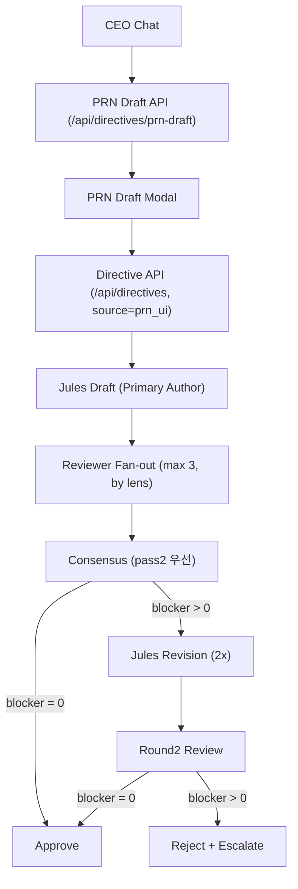

# DonggriCompany

DonggriCompany는 대표 지시를 프로젝트 단위로 실행하고, 아바타 협업/리뷰/승인까지 관리하는 로컬 우선 오케스트레이션 시스템입니다.

## 핵심 변경(v2)
- 대표 채팅 `PRN 작성` 버튼 + `/prn` 명령 지원
- `POST /api/directives/prn-draft` 추가 (표준형 v1 PRN 초안 생성)
- Jules 고정 작성자 + 리뷰어 3명 fan-out + 2라운드 제한 + 2x 심사숙고 강제
- Decision Inbox에 리뷰어 verdict / blocker delta / Jules 반영 여부 노출
- 한글 깨짐 방어를 저장/조회/브로드캐스트/렌더 전 구간에 적용
- 팩 정책: `development` 기본 + 무지정 시 `donggri` 자동 라우팅

## 아키텍처 개요



## PRN 작성 플로우
1. 대표 채팅에서 `PRN 작성` 버튼 클릭 또는 `/prn <요구사항>` 입력
2. 기존 프로젝트/신규 프로젝트 선택 다이얼로그 진행
3. `POST /api/directives/prn-draft` 호출로 PRN 초안 생성
4. PRN 모달에서 `지시 전송 / 초안 재생성 / 취소` 중 선택
5. `지시 전송` 시 기존 `POST /api/directives` 재사용 + `source: "prn_ui"` 전달

PRN 응답 타입:
- `sections`
- `directive_text`
- `confidence`
- `generation_meta` (`pass1`, `pass2`, fallback 여부 포함)

## Jules 2x 리뷰 파이프라인
- Jules: `primary_author` 고정
- 기타 아바타: `reviewer` 기본
- 리뷰어 자동 선정: Jules 제외 최대 3명
- 라운드 1:
  - blocker `0`이면 즉시 승인
  - blocker `>0`이면 Jules 재작업 필수
- 라운드 2:
  - blocker `0` 승인
  - blocker `>0` 즉시 `reject + escalation` (추가 라운드 없음)

리뷰 계약(필수):
- `pass1`
- `pass2`
- `final_verdict`
- `confidence`
- `blocking_items`

## 캐릭터 워크플로우 정책 (`workflow_profile`)

```json
{
  "role": "primary_author | reviewer",
  "review_lenses": ["security", "performance", "ux"],
  "two_pass_required": true,
  "max_review_rounds": 2
}
```

기본값:
- Jules: `primary_author`, `two_pass_required=true`, `max_review_rounds=2`
- Others: `reviewer`, `two_pass_required=true`
- 레거시 에이전트(`workflow_profile` 없음): 런타임 기본값 주입

## 팩 정책 (동그리 + 회사팩)
- 기본 팩: `development`
- `workflow_pack_key`가 명시되면 명시값 우선
- 명시가 없으면 텍스트 자동 라우팅으로 `donggri` 선택 가능
- 자동 선택 결과는 `officePackHydratedPacks`에 반영

## 한글 깨짐 안정화
- 서브태스크 제목 공용 정규화 함수 적용
- 적용 경로:
  - seed 저장
  - 조회 응답
  - 실시간 브로드캐스트
  - 최종 렌더
- 모지바케 패턴(`?쒕툕...`) 복구 및 안전 라벨 치환

## 실행 환경 (PowerShell)

### 1) 설치
```powershell
git clone https://github.com/sheryloe/DonggriCompany.git
Set-Location .\DonggriCompany
corepack enable
corepack pnpm install
```

### 2) 환경 변수
```powershell
Copy-Item .\.env.example .\.env
```

필수:
- `API_AUTH_TOKEN`
- `INBOX_WEBHOOK_SECRET`
- `OAUTH_ENCRYPTION_SECRET`

주의:
- `OAUTH_GITHUB_CLIENT_SECRET` 미설정은 기본 빈값 처리 가능
- GitHub OAuth가 필요할 때만 `.env`에 설정

### 3) 로컬 실행
```powershell
corepack pnpm run dev:local
```

## 테스트/검증

### 자동 테스트
```powershell
corepack pnpm run test:web
corepack pnpm run test:api
corepack pnpm run build
```

### 통합 스모크 (PRN + 리뷰 게이트)
```powershell
$env:QA_API_AUTH_TOKEN="__CHANGE_ME__"
node .\scripts\qa\prn-review-pipeline-smoke.mjs
```

## Docker 운영

### 시작
```powershell
docker compose up -d --build
```

### 재시작
```powershell
docker compose restart donggricompany
```

### 상태/로그
```powershell
docker compose ps
docker compose logs --tail 200 donggricompany
```

## 문서
- [skills.md](./skills.md): 캐릭터 2배 모드/심사숙고 모드/스킬 한글화 운영 기준

## License
- `LICENSE` 참고
