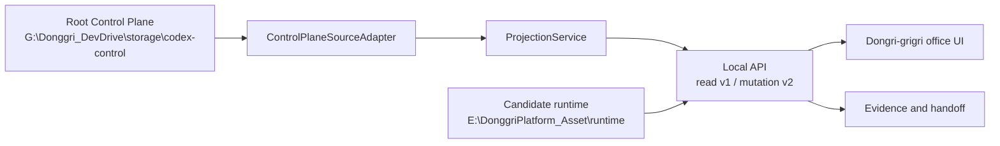

# Dongri-grigri V01

Dongri-grigri는 `G:\Donggri_DevDrive`의 단일 Control Plane을 사무실형 운영 화면으로 투영하는 로컬 우선 애플리케이션입니다. Spec, 승인, 프로젝트 범위, 실행 상태, 증거와 handoff를 한 화면에서 확인하되, 애플리케이션 DB나 UI를 새로운 source of truth로 만들지 않습니다.

## 현재 상태

| 항목         | 현재 값                                       |
| ------------ | --------------------------------------------- |
| 제품         | `Dongri-grigri V01`                           |
| 패키지 버전  | `1.0.0-alpha.2`                               |
| 릴리스 epoch | `dongri-grigri-v1`                            |
| 후보 ID      | `dongri-grigri-v01-alpha.2`                   |
| 채널         | `alpha`                                       |
| 단계         | `Advanced Alpha / Pre-certification / Pre-RC` |
| 운영 범위    | Windows 로컬 운영                             |
| 구현 브랜치  | `main`                                        |

이 표는 stable 인증이나 배포 완료를 뜻하지 않습니다. 현재 후보는 로컬 V01 완성을 향해 검증 중이며, 프로덕션 배포와 공개 배포는 이 저장소의 현재 완료 범위가 아닙니다. 최신 작업 단계와 승인 상태는 다음 root spec이 권위입니다.

```text
G:\Donggri_DevDrive\storage\codex-control\specs\20260725-donggricompany-v1-stabilization-certification-v1
```

## 제품 경계

- `G:\Donggri_DevDrive\storage\codex-control`이 운영 source of truth입니다.
- Dongri-grigri는 그 상태를 읽고 검증 가능한 UI와 API로 투영합니다.
- 프로젝트 등록 상태는 `registry\projects.yaml`, 활성 작업은 `specs\_active.md`를 따릅니다.
- Codex 인증, OAuth, 토큰, 비밀정보, 원문 transcript는 Dongri-grigri의 소유물이 아닙니다.
- Git, DB reset, Docker 변경, 배포, secrets 변경, evidence 정리는 정확한 범위의 별도 승인이 필요합니다.
- 과거 `2.0.4` 상태는 V01과 숫자로 직접 비교하지 않으며, 별도 migration bridge를 통해서만 전환합니다.

## 두 가지 조직 모델

제품 화면과 SDD 운영 조직은 목적이 다릅니다.

### 사용자 화면의 6 masters

| Master          | 기본 역할                        |
| --------------- | -------------------------------- |
| 기획 마스터     | 목표, 요구사항, 우선순위         |
| 개발 마스터     | 구현, 통합, 기술 검증            |
| 디자인 마스터   | 정보 구조, UI, 접근성            |
| 품질 마스터     | 테스트, 회귀, 인증 게이트        |
| 운영 마스터     | 로컬 runtime, Git, 증거, handoff |
| 외부강사 마스터 | 제한된 자문과 학습 피드백        |

화면의 기본 모델은 6 masters와 single OPS입니다. 과거 22명 직원, 팀장·시니어·주니어 계층, 11개 부서 모델은 V01 기본 UI 모델이 아닙니다.

### SDD의 6 operating departments

| Department | 책임                                 |
| ---------- | ------------------------------------ |
| CONTROL    | root 상태, 라우팅, 승인, 품질 게이트 |
| SPEC       | 요구사항, 설계, task, repo-map       |
| EXPLORE    | 읽기 전용 조사와 컨텍스트 복원       |
| IMPLEMENT  | 승인된 경로의 코드·문서 구현         |
| REVIEW     | findings-first 검토와 회귀 위험 확인 |
| OPS        | runtime, Git, 증거, handoff          |

프로젝트는 OPS의 project scope이며 별도 영구 운영 에이전트가 아닙니다. 일회성 persona는 한 작업에만 사용하고 parent department가 결과를 수용하거나 폐기합니다.

## 구조



주요 구현 경계:

- Control Plane projection: YAML/schema 기반 상태 읽기와 source epoch 추적
- API: v1 읽기 호환성과 v2 preview/approval/execute mutation
- Mutation authorization: approval receipt, idempotency, origin·CSRF 검증
- Durable runtime: hash-chain journal, checkpoint, SSE resume
- Image Workbench: 제한된 이미지 입력, lineage, 승인, export 결합
- UX evidence: 실제 run, event, evidence만 표시하고 synthetic 결과와 구분

## 저장소와 드라이브 역할

| 위치 | 역할                                                              |
| ---- | ----------------------------------------------------------------- |
| `C:` | Codex 논리 홈, 인증, 설정, DB, skills와 junction alias            |
| `G:` | 소스 코드, Control Plane 문서, 경량 운영 상태                     |
| `F:` | 업데이트 staging, 복구 staging, 운영 로그와 manifest              |
| `E:` | 독립 백업, 장기 archive, 대용량 asset, candidate runtime evidence |
| `D:` | 시스템 예약 영역; 프로젝트 작업에 사용하지 않음                   |

F:와 G:는 같은 물리 디스크의 다른 볼륨이므로 서로의 독립 백업으로 간주하지 않습니다.

AgentMemory 기본 후보:

| 항목       | 경로 또는 주소                                 |
| ---------- | ---------------------------------------------- |
| Runtime    | `E:\DonggriPlatform_Asset\runtime\agentmemory` |
| Data/index | `E:\DonggriPlatform_Asset\storage\agentmemory` |
| Server     | `http://127.0.0.1:3111`                        |
| Viewer     | `http://127.0.0.1:3113`                        |

AgentMemory는 검색·회상 계층입니다. Root Control Plane을 대체하지 않으며 remember, capture, hook, delete, forget, import에는 별도 승인이 필요합니다.

## 로컬 실행

### 요구사항

- Windows
- Node.js `22` 이상
- Corepack
- pnpm `10.30.1` 계열
- 선택 사항: Docker Desktop

### 빠른 시작

현재 V01 worktree에서 CMD를 실행합니다.

```bat
cd /d G:\Donggri_DevDrive\worktrees\DonggriCompany-v01-main
corepack pnpm install --frozen-lockfile
corepack pnpm run dev:local
```

기본 endpoint:

| Surface | URL                                |
| ------- | ---------------------------------- |
| Web     | `http://127.0.0.1:8800`            |
| API     | `http://127.0.0.1:8790`            |
| Health  | `http://127.0.0.1:8790/api/health` |

CMD health check:

```bat
curl.exe -fsS http://127.0.0.1:8790/api/health
```

`.env.example`은 placeholder 계약입니다. `__CHANGE_ME__` 값을 실제 인증값으로 오인하지 말고, 로컬 secrets를 문서·로그·Git에 기록하지 마십시오. OAuth, webhook, messenger 또는 외부 provider 설정 변경은 별도 승인 범위에서 수행합니다.

## Docker 로컬 운영

Docker는 선택 사항이며 기본 안전 동작이 아닙니다. 실행 전에 compose 해석 결과를 확인합니다.

```bat
cd /d G:\Donggri_DevDrive\worktrees\DonggriCompany-v01-main
docker compose config
```

승인된 경우에만 컨테이너를 시작합니다.

```bat
docker compose up -d --build
```

기본 Docker endpoint는 `http://127.0.0.1:8900`입니다. Compose의 기본 writable runtime root는 `E:\DonggriPlatform_Asset\runtime\DonggriCompany`이며 DB, logs, account profiles, worktrees를 source tree 밖에 둡니다.

Volume 삭제, `docker system prune`, 인증정보 변경과 운영 배포는 암묵적으로 수행하지 않습니다.

## 검증

### 정적 검사

```bat
corepack pnpm run format:check
corepack pnpm run lint
corepack pnpm exec tsc -p tsconfig.app.json --noEmit --pretty false
corepack pnpm exec tsc -p tsconfig.node.json --noEmit --pretty false
corepack pnpm run openapi:check
corepack pnpm run build
```

### 테스트

```bat
corepack pnpm run test:web
corepack pnpm run test:api
corepack pnpm run test:e2e
```

GitHub Actions와 가까운 전체 검증:

```bat
corepack pnpm run test:ci
```

### V01 계약

```bat
corepack pnpm run v1:ci-gate:self-test
corepack pnpm run v1:ci-gate
corepack pnpm run v1:openapi-floor
corepack pnpm run v1:certification-contract:self-test
corepack pnpm run v1:candidate-score:self-test
corepack pnpm run master95:delivery
```

실제 후보 점수 계산은 clean worktree와 현재 후보에 일치하는 절대 경로의 freeze record를 모두 요구합니다. 점수 산출물은 고정 파일을 덮어쓰지 않고 `score\attempts\<attempt-id>` 아래에 시도별로 새로 생성합니다.

```bat
corepack pnpm run v1:candidate-score -- --freeze-record G:\Donggri_DevDrive\storage\codex-control\specs\20260725-donggricompany-v1-stabilization-certification-v1\CANDIDATE_FREEZE_RECORD.json
corepack pnpm run v1:candidate-score -- --freeze-record G:\Donggri_DevDrive\storage\codex-control\specs\20260725-donggricompany-v1-stabilization-certification-v1\CANDIDATE_FREEZE_RECORD.json --write --attempt-id alpha2-static-001
```

검사가 통과해도 자동으로 인증, tag, push 또는 배포 권한이 생기지 않습니다. 실제 certification claim은 최종 `CERTIFICATION_DECISION.json`만 할 수 있습니다.

## 안전 규칙

- 작업 전에 root `AGENTS.md`, project registry, `_active.md`, steering과 learnings를 확인합니다.
- 등록 worktree가 있으면 baseline `repos\DonggriCompany` 대신 worktree에서 구현합니다.
- 사용자 변경, dirty reference workspace와 기존 evidence를 임의로 reset·restore·merge하지 않습니다.
- `.tmp`, `test-results`, logs, DB, coverage, `dist`, backups와 token material을 commit하지 않습니다.
- Commit, push, merge, reset, rebase, stash, clean, branch 삭제는 별도 명시 승인이 필요합니다.
- App DB reset은 승인 후 `corepack pnpm run db:reset:dongri`를 사용합니다.
- 인증 후보 runtime은 candidate ID와 source epoch에 묶으며 실패한 후보의 evidence를 덮어쓰지 않습니다.

## V01 완료 순서

1. `alpha.2` 통합 후보와 UX/browser smoke 완료
2. 로컬 `2.0.4` migration bridge 구현·복구 리허설
3. Candidate repo 외부 assessor trust root 확정
4. 재시작 가능한 장기 runtime과 실제 Soak/Pilot
5. 두 독립평가자 평가와 Final Evidence Pack
6. V01 인증 결정 후 local `main` 완성

각 단계는 이전 Gate가 통과해야 진행합니다. Push, tag, GitHub Release와 프로덕션 배포는 각각 별도 승인입니다.

## Repository map

| 경로                                  | 역할                                                  |
| ------------------------------------- | ----------------------------------------------------- |
| `server/`                             | Express API, SQLite, Control Plane, mutation, journal |
| `src/`                                | React/Vite UI                                         |
| `src/components/OfficeView.tsx`       | 사무실형 기본 화면                                    |
| `src/components/ControlPlanePage.tsx` | Control Plane 상세 화면                               |
| `scripts/`                            | 검증, OpenAPI, V01와 Master95 도구                    |
| `contracts/v1/`                       | V01 계약과 동결 baseline                              |
| `tests/e2e/`                          | 격리 E2E journey                                      |
| `deploy/`                             | 로컬 배포 template과 rollback runbook                 |
| `docs/`                               | 설계·운영 참고 문서                                   |

이 root `README.md`는 현재 V01 입문 문서입니다. 운영 source of truth는 계속 root Control Plane이며, `README_ko.md`, `README_jp.md`, `README_zh.md`는 별도 이관 전까지 legacy compatibility 문서입니다.

## License

Apache License 2.0을 따릅니다. 자세한 내용은 `LICENSE`와 `NOTICE`를 확인하십시오.
