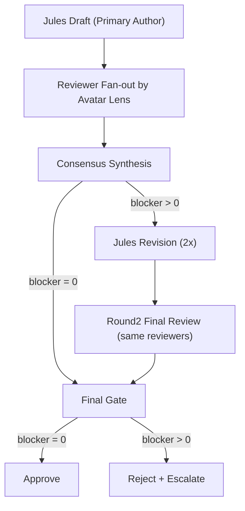

# DonggriCompany

DonggriCompany는 Claw-Empire 기반의 로컬 우선 AI 오케스트레이션 시스템입니다.

- 다중 CLI/ OAuth/ API 에이전트 오케스트레이션
- 픽셀 오피스 UI + 태스크보드 + 의사결정 인박스
- 프로젝트 단위 워크플로우/리뷰/보고 자동화
- Docker 기반 운영 가능

---

## 1) 핵심 기능

- 에이전트 회사 시뮬레이션: Planning/Development/Design/QA/DevSecOps/Operations
- 멀티 프로바이더: Claude Code, Codex, Gemini, Jules, OpenCode 등
- 프로젝트 중심 실행: `project_path` 기준 안전 실행/추적
- 의사결정 인박스: 라운드별 리뷰 응답/승인 흐름
- 보고서/회의록 자동 생성
- 로컬 SQLite + WebSocket 실시간 상태 반영

---

## 2) 최신 워크플로우 (Jules 중심 Avatar 2x 리뷰 파이프라인)

적용 상태: 반영 완료

- Jules는 항상 `primary_author`
- 나머지 아바타는 `reviewer`로 병렬 리뷰
- 리뷰는 최대 2라운드
- 모든 리뷰/재작성 단계에서 2x 심사숙고 강제
  - `pass1`
  - `pass2 (counter-check)`
  - `final_verdict`
  - `confidence`
  - `blocking_items`

파이프라인:



---

## 3) 시스템 요구사항

- Windows 11 + PowerShell 7 권장
- Node.js >= 22
- Git
- Docker Desktop (운영/컨테이너 실행 시)

확인 명령:

```powershell
node -v
git --version
docker --version
docker compose version
```

---

## 4) 로컬 개발 실행 (PowerShell)

### 4-1. 설치

```powershell
git clone https://github.com/sheryloe/DonggriCompany.git
Set-Location .\DonggriCompany
corepack enable
corepack pnpm install
```

### 4-2. 환경 변수 준비

```powershell
Copy-Item .\.env.example .\.env
```

`.env` 필수 항목:

- `OAUTH_ENCRYPTION_SECRET`
- `API_AUTH_TOKEN`
- `INBOX_WEBHOOK_SECRET` (inbox webhook 사용 시)

랜덤 시크릿 생성:

```powershell
node -e "console.log(require('crypto').randomBytes(32).toString('hex'))"
```

### 4-3. 개발 서버 실행

```powershell
corepack pnpm run dev:local
```

기본 접속:

- Web: `http://127.0.0.1:8800`
- API: `http://127.0.0.1:8790`
- Health: `http://127.0.0.1:8790/healthz`

---

## 5) Docker 실행/운영

프로젝트에는 `Dockerfile`, `docker-compose.yml`가 포함되어 있습니다.

### 5-1. 최초 실행

```powershell
docker compose up -d --build
```

### 5-2. 상태/로그

```powershell
docker compose ps
docker compose logs -f donggricompany
```

### 5-3. 재시작

```powershell
docker compose restart donggricompany
```

### 5-4. 완전 재배포

```powershell
docker compose down
docker compose up -d --build
```

기본 포트 매핑:

- `7777:7777`
- `8790:7777`

---

## 6) 검증 명령 (복붙용)

```powershell
corepack pnpm run build
corepack pnpm run test:api
corepack pnpm run test:web
```

개별 점검:

```powershell
corepack pnpm exec vitest run --config server/vitest.config.ts server/modules/workflow/orchestration/meetings/leader-selection.test.ts
corepack pnpm exec vitest run --config server/vitest.config.ts server/modules/routes/ops/messages/decision-inbox/yolo-mode.test.ts
```

---

## 7) 주요 스크립트

```powershell
corepack pnpm run dev:local
corepack pnpm run build
corepack pnpm run start
corepack pnpm run test:api
corepack pnpm run test:web
corepack pnpm run test:ci
corepack pnpm run lint
corepack pnpm run format:check
```

---

## 8) 동그리팩(오픈소스 캐릭터 에셋)

반영 경로:

- `assets/opensource/characters/kenney_tiny_dungeon.zip`
- `assets/opensource/characters/tiny_rpg_cc0_portraits.zip`
- `assets/opensource/characters/THIRD_PARTY_LICENSES.md`
- 압축 해제본: `assets/opensource/characters/kenney_tiny_dungeon/*`, `assets/opensource/characters/tiny_rpg_cc0_portraits/*`

주의:

- 배포 시 서드파티 라이선스 문서를 반드시 포함
- 상용/재배포 정책은 각 원본 라이선스 기준으로 검토

---

## 9) 디렉터리 구조

```text
DonggriCompany/
├─ server/                     # Express + workflow engine + routes
├─ src/                        # React UI
├─ assets/opensource/          # 동그리팩 포함 오픈소스 에셋
├─ scripts/                    # setup / QA / migration 스크립트
├─ docs/                       # API, 릴리즈, 설계 문서
├─ docker-compose.yml
├─ Dockerfile
├─ .env.example
└─ README.md
```

---

## 10) 문제 해결

- 포트 충돌
  - `Get-NetTCPConnection -LocalPort 8790,8800,7777`
- 의존성 꼬임
  - `Remove-Item -Recurse -Force .\node_modules`
  - `Remove-Item -Force .\pnpm-lock.yaml` (필요 시)
  - `corepack pnpm install`
- Docker 컨테이너 비정상
  - `docker compose logs -f donggricompany`
  - `docker compose down`
  - `docker compose up -d --build`

---

## 11) 보안

- 토큰/시크릿은 반드시 `.env`로 관리
- `OAUTH_ENCRYPTION_SECRET` 미설정 상태로 운영 금지
- 외부 접근 시 `API_AUTH_TOKEN` 필수 설정
- `/api/inbox` 사용 시 `INBOX_WEBHOOK_SECRET` 필수

---

## License

- 프로젝트 라이선스: 저장소 `LICENSE` 참조
- 포함된 오픈소스 에셋: `assets/opensource/characters/THIRD_PARTY_LICENSES.md` 참조
