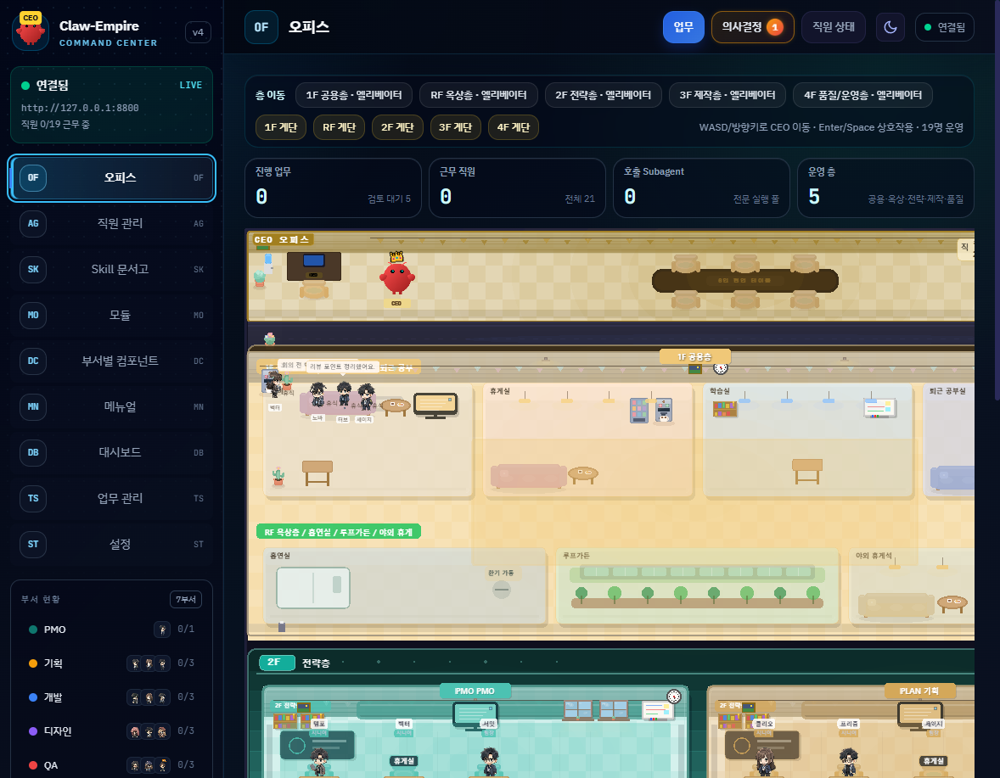
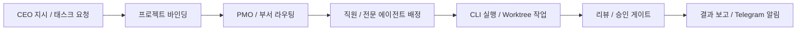
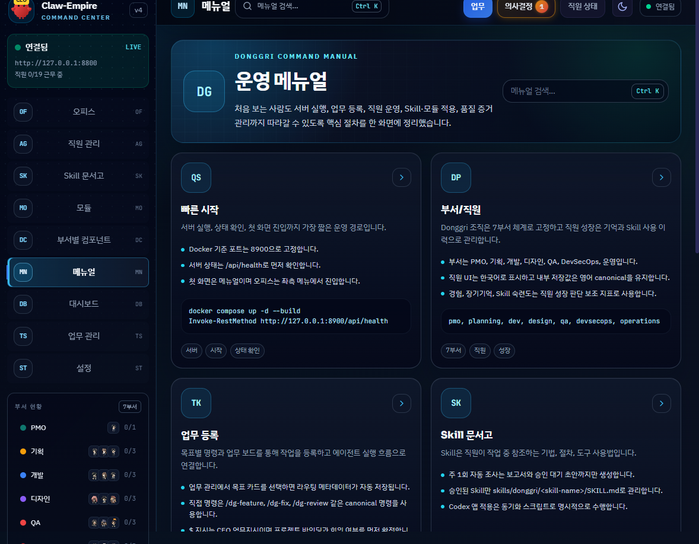
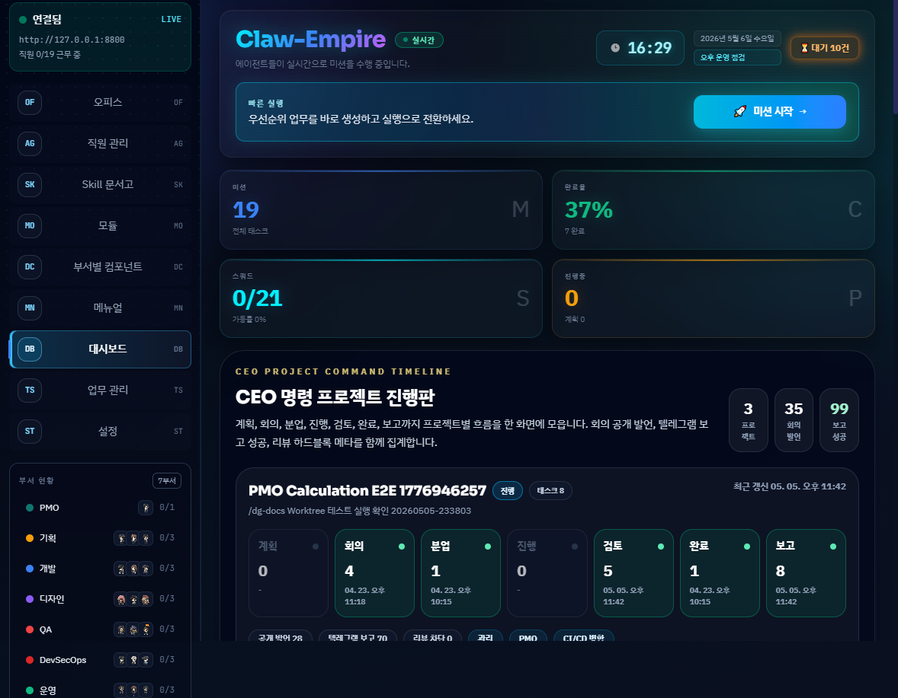
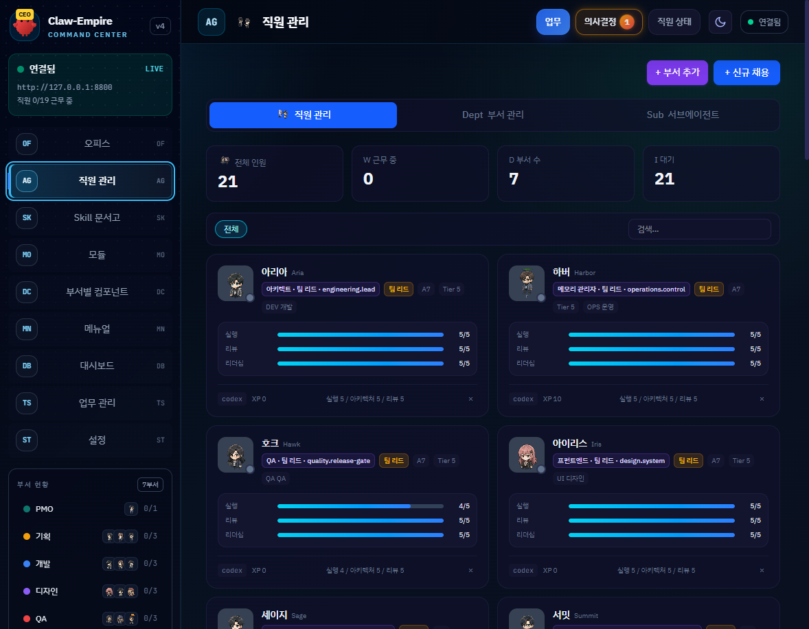
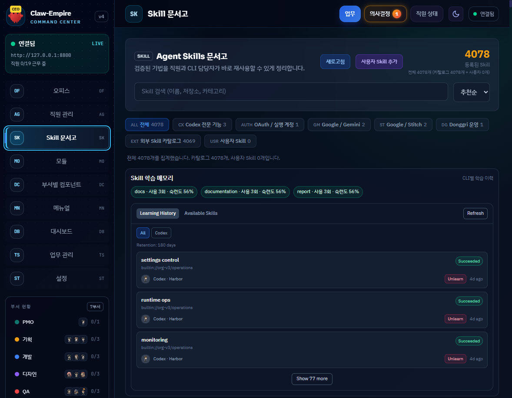
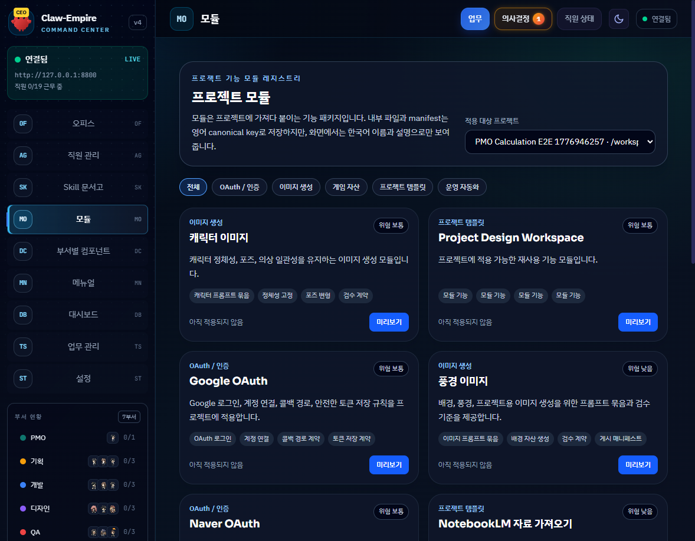
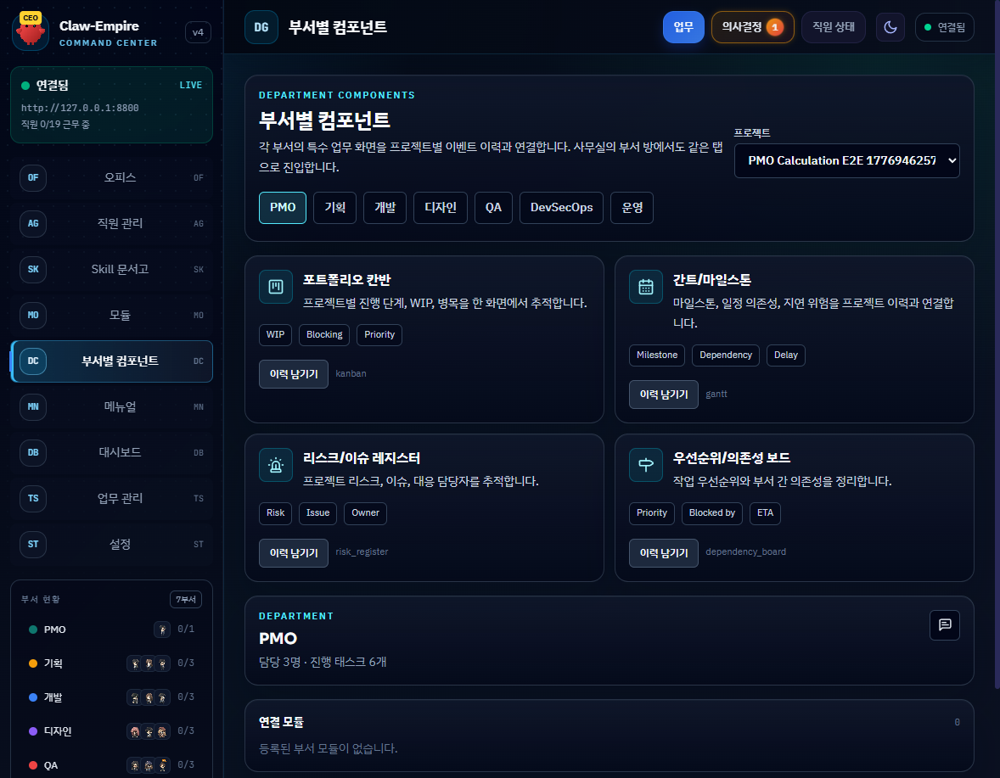
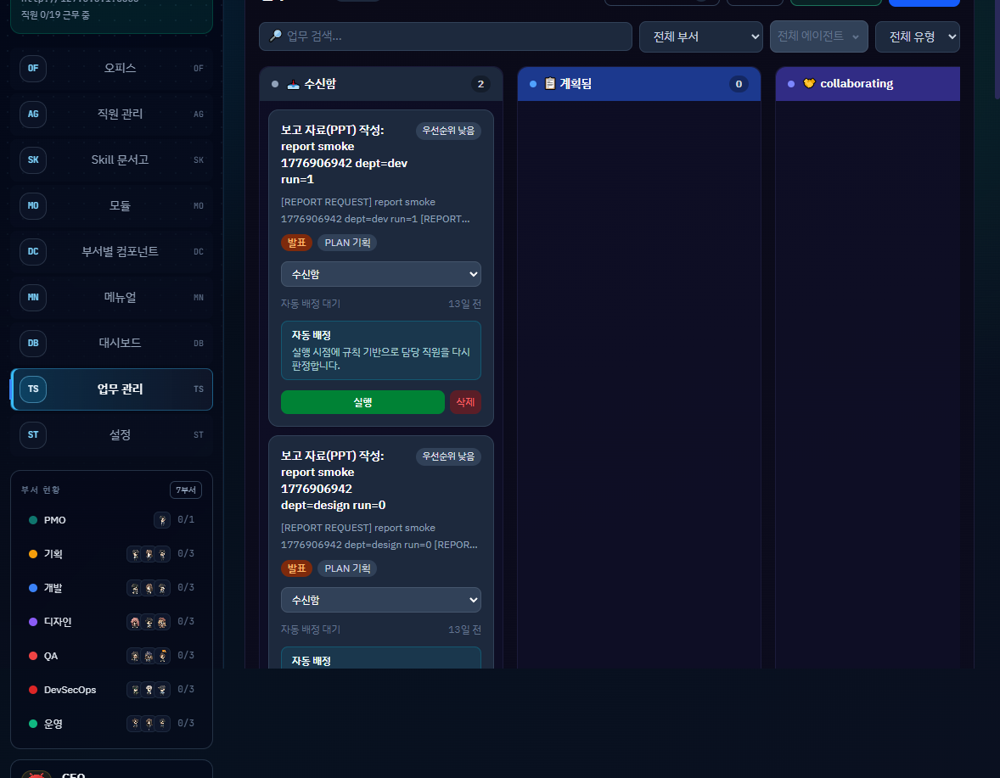
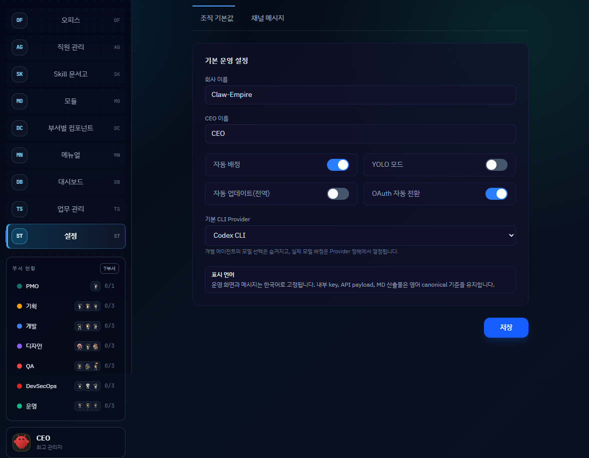

# DonggriCompany

로컬 PC 안에 AI 회사 운영실을 만들고, CEO 지시를 프로젝트 단위로 접수한 뒤 부서, 직원, 전문 에이전트, 리뷰 게이트, 보고까지 추적하는 **local-first AI company operations platform**입니다.

DonggriCompany는 [Claw-Empire](https://github.com/GreenSheep01201/claw-empire)를 기반으로 한 Apache-2.0 파생 프로젝트입니다. 원본의 AI agent office simulator 구조를 유지하면서 Donggri 조직 운영, Dev Drive 런타임 분리, 7부서/19명 직원 모델, 자동 라우팅, 문서형 품질 기록, 한국어 운영 UI에 맞게 확장했습니다.

<p>
  <a href="https://github.com/sheryloe/DonggriCompany"></a>
  
  
  
  
</p>



## 핵심 요약

- **CEO 지시 운영**: `$` 지시를 프로젝트에 바인딩하고 PMO/팀장 회의 여부를 거쳐 실행 흐름으로 보냅니다.
- **태스크 자동 라우팅**: `#` 요청은 직접 실행하지 않고 task board에 등록한 뒤 서버 resolver가 프로젝트, workflow pack, 부서, 담당 직원, specialist subagent를 결정합니다.
- **조직형 에이전트 런타임**: 7개 canonical 부서와 19명 활성 직원을 기준으로 운영합니다.
- **로컬 우선 구조**: SQLite, worktree, 로그, 인증 상태를 로컬 런타임에 두고 소스 저장소와 분리합니다.
- **실행/리뷰/보고 게이트**: task lifecycle, approval gate, review consent, Telegram 단일 그룹 보고 흐름을 추적합니다.
- **공개 가능 라이선스**: Apache-2.0 기반으로 수정, 재배포, 상업적 사용이 가능하며 원본 저작권/라이선스/NOTICE 의무를 보존합니다.



## 화면 미리보기

Browser Use로 `http://127.0.0.1:8800`의 실제 앱 화면을 캡처해 `docs/assets/readme/`에 저장했습니다.

| Manual | Dashboard | Office View |
|---|---|---|
|  |  |  |

| Agent Manager | Skill Library | Modules |
|---|---|---|
|  |  |  |

| Department Components | Task Board | Settings |
|---|---|---|
|  |  |  |

## 주요 화면

| 화면 | 역할 |
|---|---|
| Manual | 서버 실행, 업무 등록, 직원 운영, Skill/모듈 적용, 품질 증거 관리 절차를 한 화면에 정리합니다. |
| Dashboard | 회사, 프로젝트, 태스크, provider, 런타임 상태를 요약합니다. |
| Office View | 1F shared, 2F strategy, 3F production, 4F quality/operations 구조로 부서와 직원을 표시합니다. |
| Agent Manager | 직원 추가/수정, 부서, 직급, 능력치, CLI 계정 풀을 관리합니다. |
| Skill Library | Codex와 직원 작업에 연결되는 Skill 문서를 검색하고 상태를 확인합니다. |
| Modules | Google OAuth, NotebookLM import, 디자인 워크스페이스 같은 기능 패키지를 관리합니다. |
| Department Components | 부서별 책임 컴포넌트와 workflow pack 연결 상태를 확인합니다. |
| Task Board | inbox, planned, in progress, review, done 흐름을 관리합니다. |
| Settings | canonical inspector, workflow pack inspector, API/CLI/OAuth/Telegram 설정을 관리합니다. |

## 원본과 라이선스

이 프로젝트는 공개된 [GreenSheep01201/claw-empire](https://github.com/GreenSheep01201/claw-empire)를 기반으로 합니다.

- 원본 라이선스: Apache License 2.0
- 이 저장소 라이선스: Apache License 2.0
- SPDX identifier: `Apache-2.0`
- 원본 저작권 표시는 `LICENSE`와 `NOTICE`에 보존합니다.
- 서드파티 캐릭터 자산 표시는 `assets/opensource/characters/THIRD_PARTY_LICENSES.md`에 보존합니다.

Apache-2.0은 수정, 복제, 배포, 파생 저작물 작성, 상업적 사용을 허용합니다. 공개 배포 시에는 라이선스 사본 제공, 기존 저작권/귀속 표시 보존, 수정 사실 표시, 필요한 경우 NOTICE 포함을 지켜야 합니다.

## Donggri 확장점

원본 Claw-Empire 대비 이 저장소는 다음 방향으로 확장되어 있습니다.

- Donggri Dev Drive 기준 프로젝트/런타임 루트 분리
- 7개 canonical 부서와 19명 활성 직원 운영 규칙
- PMO triage와 자동 라우팅 resolver 중심 운영
- 한국어 사용자-facing UI와 영어 canonical key 분리
- `docs/QUALITY_LOG.md`, `docs/REQUIREMENTS.md`, `docs/DECISIONS.md`, `docs/RISK_REGISTER.md` 기반 품질 기록
- README용 실제 앱 캡처와 공개 전 라이선스/NOTICE 정리
- Docker Compose 런타임 데이터 분리와 worktree 운영 기준

## 조직 모델

현재 기본 조직은 7개 canonical 부서와 19명 활성 직원을 기준으로 설계되어 있습니다.

| 부서 | 책임 |
|---|---|
| `pmo` | CEO 지시 정리, 분배, 리스크와 일정 통제 |
| `planning` | 제품 기획, 요구사항 정리, 설계 방향 수립 |
| `dev` | 프론트엔드, 백엔드, TypeScript, 데이터 접근 구현 |
| `design` | UI/UX, 접근성, 사용자-facing 화면 품질 |
| `qa` | 테스트, 회귀 검증, 리뷰와 품질 증거 관리 |
| `devsecops` | GitHub workflow, CI, 보안, 배포와 인프라 운영 |
| `operations` | 문서, 고객/사용자 보고, 신뢰성, runbook 유지 |

PMO는 `team_leader` 1명만 유지합니다. 나머지 6개 부서는 각각 `team_leader` 1명과 `senior` 2명을 유지합니다. `junior`는 성장/legacy compatibility 용도로만 남기고 기본 seed로 사용하지 않습니다.

내부 key, API field, DB 값, generated policy text는 영어 canonical을 유지합니다. 사용자-facing UI, toast, status text는 한국어를 우선합니다.

## 요청 라우팅

### `$` CEO Directive

`$`로 시작하는 메시지는 CEO directive입니다.

1. 기존 프로젝트 또는 신규 프로젝트를 확정합니다.
2. 프로젝트 ID, 경로, core goal을 지시에 바인딩합니다.
3. PMO/팀장 회의 여부를 결정합니다.
4. `/api/inbox` 또는 `/api/directives`로 지시를 등록합니다.
5. 서버가 태스크 생성, 분업, 실행, 리뷰, 보고를 이어갑니다.

### `#` Task Registration

`#`로 시작하는 요청은 현재 assistant가 직접 실행하지 않고 task board에 등록합니다.

1. `#` prefix를 제거합니다.
2. `/api/inbox`에 등록합니다.
3. resolver가 프로젝트, workflow pack, 부서, 담당 직원, specialist subagent를 자동 결정합니다.
4. 라우팅 신뢰도가 낮으면 사용자에게 임시 경로를 묻지 않고 PMO triage로 보냅니다.

## 실행 정책

- 기본 실행 provider는 `codex`입니다.
- provider/model 수동 override는 compatibility-only입니다.
- 다중 계정은 라우팅 결정 소스가 아니라 실행 계층의 failover/쿼터 분산 용도입니다.
- `role`, `workflow_role`, `acts_as_planning_leader`는 compatibility mirror입니다.
- `workflow_pack_key`는 쓰기 결정 소스가 아니라 read-only projection/표시 정보입니다.
- PMO chair와 authority/quorum/gate 규칙은 canonical identity 기준으로 판단합니다.
- 승인 게이트 부족 시 hard block을 걸고 `workflow_meta_json.review_consent`에 사유를 남깁니다.

## 빠른 시작

필수 조건:

- Node.js `>=22`
- Corepack / pnpm
- Git
- Codex CLI
- Docker Desktop은 Docker 실행이 필요할 때만 사용

설치:

```powershell
git clone https://github.com/sheryloe/DonggriCompany.git
Set-Location .\DonggriCompany
corepack enable
corepack pnpm install
```

환경 파일:

```powershell
Copy-Item .\.env.example .\.env
```

필수 환경 변수:

- `API_AUTH_TOKEN`
- `INBOX_WEBHOOK_SECRET`
- `OAUTH_ENCRYPTION_SECRET`

선택 연동:

- `TELEGRAM_BOT_TOKEN`
- `TELEGRAM_CHAT_ID`
- `GITHUB_TOKEN`
- `OAUTH_GITHUB_CLIENT_ID`
- `OAUTH_GITHUB_CLIENT_SECRET`

민감정보는 커밋하지 않습니다. `.env`, 로컬 인증 저장소, DB, 로그, token/key/credential 파일은 공개 저장소에 포함하지 않습니다.

## 로컬 실행

```powershell
corepack pnpm run dev:local
```

기본 주소:

- Web: `http://127.0.0.1:8800`
- API: `http://127.0.0.1:8790`

헬스 체크:

```powershell
Invoke-RestMethod -Uri "http://127.0.0.1:8790/api/health" | ConvertTo-Json -Compress
```

## Docker 운영

런타임 상태는 기본적으로 소스 저장소 밖에 보관합니다.

| 항목 | 경로 |
|---|---|
| 호스트 런타임 루트 | `..\runtime\DonggriCompany` |
| 컨테이너 DB/log 경로 | `/app/data` |
| 컨테이너 worktree 루트 | `/runtime/worktrees/DonggriCompany` |

기존 `.\data` 기반 런타임을 처음 이관할 때는 대상이 없는 상태에서만 복사합니다.

```powershell
docker compose stop donggricompany
New-Item -ItemType Directory -Force -Path ..\runtime\DonggriCompany | Out-Null
Copy-Item .\data ..\runtime\DonggriCompany\data -Recurse
Copy-Item .\data\office-accounts ..\runtime\DonggriCompany\office-accounts -Recurse
New-Item -ItemType Directory -Force -Path ..\runtime\DonggriCompany\worktrees | Out-Null
```

시작/재빌드:

```powershell
docker compose up -d --build
```

상태 확인:

```powershell
docker compose ps
docker compose logs --tail 200 donggricompany
Invoke-RestMethod -Uri "http://127.0.0.1:8790/api/health" | ConvertTo-Json -Compress
```

## API 요약

| 영역 | Endpoint |
|---|---|
| Health | `GET /api/health` |
| Tasks | `GET /api/tasks`, `POST /api/tasks`, `POST /api/tasks/:id/run`, `POST /api/tasks/:id/assign` |
| Projects | `GET /api/projects`, `POST /api/projects` |
| Agents | `GET /api/agents`, `POST /api/agents` |
| Departments | `GET /api/departments` |
| Inbox | `POST /api/inbox` |
| Directives | `POST /api/directives` |
| Routing | `POST /api/company/routing/preview` |
| Workflow packs | `GET /api/workflow-packs` |
| Messenger | `GET /api/messenger/sessions`, `POST /api/messenger/send` |
| CLI status | `GET /api/cli-status` |

보호 API는 세션 인증 또는 bearer token이 필요합니다.

```powershell
$session = New-Object Microsoft.PowerShell.Commands.WebRequestSession
$auth = Invoke-RestMethod -Uri "http://127.0.0.1:8790/api/auth/session" -WebSession $session
```

## 검증

기본 회귀:

```powershell
corepack pnpm test
corepack pnpm build
```

분리 실행:

```powershell
corepack pnpm run test:web
corepack pnpm run test:api
corepack pnpm run test:e2e
```

운영 스모크:

```powershell
docker compose up -d --build
docker compose ps
Invoke-RestMethod -Uri "http://127.0.0.1:8790/api/health" | ConvertTo-Json -Compress
```

## 공개 전 체크리스트

이 저장소를 public으로 전환하기 전 최소 기준:

- `package.json`에 `"license": "Apache-2.0"` 명시
- `LICENSE` 유지
- `NOTICE`에 원본 Claw-Empire 귀속 표시
- `README.md`에 원본/파생/라이선스 관계 명시
- `assets/opensource/characters/THIRD_PARTY_LICENSES.md` 유지
- `.env`, DB, 로그, token/key/credential 파일이 tracked 상태가 아닌지 확인
- Git 히스토리 secret scan 수행
- GitHub 저장소 공개 전환은 마지막에 수동 확인 후 진행

## 데이터와 보존 정책

- 기본 Docker 호스트 DB 경로: `..\runtime\DonggriCompany\data\claw-empire.sqlite`
- Docker DB 경로: `/app/data/claw-empire.sqlite`
- 작업 worktree 경로: `..\runtime\DonggriCompany\worktrees`
- DB, WAL, SHM 파일은 커밋하지 않습니다.
- 복구가 필요한 경우 원본 DB와 sidecar 파일을 먼저 백업한 뒤 dump/import 또는 새 DB bootstrap을 수행합니다.

## 저장소 정리 기준

커밋 대상:

- `server/`
- `src/`
- `agents/`의 실제 기본 직원/부서 가이드
- `scripts/`
- `docs/`
- `docs/assets/readme/`의 README용 UI 캡처
- `assets/opensource/characters/THIRD_PARTY_LICENSES.md`
- 설정/테스트 파일

커밋 제외:

- `.env`
- `data/`
- `logs/`
- `test-results/`
- `.tmp/`
- `coverage/`
- `dist/`
- `agents/archive/`
- `agents/ci_*`
- `agents/e2e*`
- `scratch/`
- token, key, credential, password, private auth material

## 문서 체계

| 파일 | 목적 |
|---|---|
| `AGENTS.md` | 프로젝트별 Codex와 orchestration 규칙 |
| `PERSONA.md` | 프로젝트 에이전트 persona와 응답 기준 |
| `CHANGELOG.md` | 사용자 관점 변경 이력 |
| `docs/QUALITY_LOG.md` | 작업 기록, 검증 근거, 리스크 메모 |
| `docs/REQUIREMENTS.md` | 요구사항과 활성 기준 |
| `docs/DECISIONS.md` | 설계와 운영 결정 |
| `docs/RISK_REGISTER.md` | 리스크와 대응 |
| `docs/GIT_WORKFLOW.md` | Git workflow와 안전 규칙 |
| `docs/OPERATIONS.md` | Docker, runtime, backup, 운영 runbook |

## License

DonggriCompany is licensed under the Apache License, Version 2.0. See `LICENSE`.

This project includes software derived from Claw-Empire by GreenSheep01201. See `NOTICE`.

<!-- BEGIN DONGGRI_DEV_DRIVE_STANDARD -->
## Dev Drive Operating Baseline

This repository is maintained under the Donggri Dev Drive migration baseline.

- Active project root: `<PROJECT_ROOT>`
- Runtime root: `<RUNTIME_ROOT>`
- Project runtime candidate: `<PROJECT_RUNTIME_ROOT>`
- Local bare Git server: `<LOCAL_GIT_SERVER_ROOT>`
- Package cache root: `<PACKAGE_CACHE_ROOT>`
- Storage/archive root: `<STORAGE_ROOT>`
- The old D platform root has been removed after backup; use the G DevDrive project root.
- The old D runtime root has been removed after backup; use the G DevDrive runtime root.

### Stack Snapshot

pnpm, Vite, TypeScript, Node server modules, Docker Compose, VS Code extension.

### Command Preview

The following commands are documentation candidates only. Do not run install/build/test/Docker commands unless the user explicitly asks for execution.

```powershell
Get-Location
Get-ChildItem
corepack pnpm build; corepack pnpm test; docker compose config only after explicit approval.
```

### Safety Rules

- Do not read real `.env` files.
- Do not commit secrets, tokens, credentials, keys, passwords, generated browser profiles, or runtime outputs.
- Keep generated/heavy folders out of Codex scans and Git changes.
- Use `docs/QUALITY_LOG.md` for traceable work records.
<!-- END DONGGRI_DEV_DRIVE_STANDARD -->
