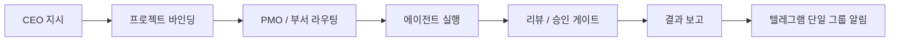

# DonggriCompany

DonggriCompany는 로컬 PC에서 CEO 지시를 프로젝트 단위로 접수하고, 에이전트 조직에 분배하고, 실행/리뷰/보고까지 추적하는 AI 회사 운영 플랫폼입니다.

현재 기준의 핵심 방향은 단순 채팅 앱이 아니라 다음 흐름을 끝까지 관리하는 것입니다.



## 현재 핵심 기능

- CEO 지시 접수: `$` 지시와 일반 채팅을 프로젝트 문맥에 묶어서 처리합니다.
- 프로젝트 관리: 기존 프로젝트 선택, 신규 프로젝트 생성, GitHub 저장소 생성/클론 흐름을 지원합니다.
- 에이전트 조직 운영: 부서, 직급, canonical identity, CLI provider, 계정 풀, 스킬/프롬프트 프로필을 관리합니다.
- PMO 분업 흐름: 지시를 태스크/서브태스크로 나누고 부서/에이전트에게 배정합니다.
- canonical 정책: provider/model override, workflow pack, legacy role 값을 실행 결정 소스가 아니라 compatibility 정보로 낮춥니다.
- 리뷰/승인 게이트: quorum, authority, approval gate 부족 시 hard block을 걸고 `workflow_meta_json.review_consent`에 사유를 남깁니다.
- 단일 텔레그램 그룹 보고: 모든 부서 보고를 하나의 텔레그램 그룹으로 보내고, 메시지 헤더 `[부서][task_id][상태]`로 구분합니다.
- Codex 다중 인증풀: 호스트 로컬 `codex auth list/check/report` 기반 계정 풀 상태를 운영 화면에서 확인합니다.
- Workflow Pack Inspector: workflow pack은 read-only projection으로 보고, 설정 write source로 쓰지 않습니다.
- Canonical Policy Inspector: routing, governance, model tier, approval gate, validation, reload/rollback 상태를 확인합니다.
- Docker 운영: 로컬 데이터 볼륨을 보존하면서 `docker compose up -d --build`로 재기동합니다.

## 주요 화면

- Dashboard: 회사/프로젝트/태스크 상태 요약
- Task Board: inbox, planned, in progress, review, done 흐름 관리
- Chat / CEO Room: 지시 입력, 프로젝트 채널형 대화, 에이전트 응답 확인
- Agent Manager: 직원 추가/수정, 부서/직급/능력치/CLI 계정 풀 관리
- Office View: 부서/직원 상태를 사무실 형태로 표시
- Project Manager: 프로젝트 생성, GitHub 연동, project staffing overlay, 진행 차트 확인
- Settings: canonical inspector, workflow pack inspector, API/CLI/OAuth/Telegram 설정 관리

## 조직 모델

기본 조직은 부서형 운영을 기준으로 설계되어 있습니다.

- `development`: 프론트엔드/백엔드 구현
- `planning-architecture`: 기획 및 설계
- `ui-ux`: UI/UX 설계
- `cicd-repo`: GitHub 저장소 생성, 브랜치, PR, 병합, 배포 흐름
- `management`: 운영 상태 관리
- `pmo`: CEO 지시 정리와 분배
- `qa`: 테스트와 회귀 검증
- `bloggent`: Bloggent CLI 기반 콘텐츠 운영
- `api-research`: 무료 토큰/API 범위 내 조사
- `security-approval`: 보안/승인 게이트
- `knowledge-docs`: STATUS, KANBAN, GANTT, DECISIONS 같은 문서 유지

각 직원은 저장용 canonical key를 유지합니다. 한국어 UI에서는 사용자에게 보이는 라벨을 한국어로 표시하고, 비한국어는 영어로 fallback합니다.

## 실행 정책

DonggriCompany의 실행 정책은 아래 원칙을 따릅니다.

- 기본 실행 provider는 `codex`입니다.
- provider/model 수동 override는 compatibility-only입니다.
- 다중 계정은 라우팅 결정 소스가 아니라 실행 계층의 failover/쿼터 분산 용도입니다.
- `role`, `workflow_role`, `acts_as_planning_leader`는 compatibility mirror입니다.
- `workflow_pack_key`는 쓰기 결정 소스가 아니라 read-only projection/표시 정보입니다.
- PMO chair와 authority/quorum/gate 규칙은 canonical identity 기준으로 판단합니다.

## 텔레그램 보고

텔레그램은 단일 그룹 모드로 동작합니다.

- 런타임은 global session 1개와 global target 1개만 사용합니다.
- 부서별 `chat_id` 라우팅은 runtime decision에서 제외됩니다.
- 부서 구분은 메시지 헤더로 처리합니다.
- 전송 로그에는 `route_kind=single_group_department_tag`와 `routing_reason=global_group`가 남습니다.

보고 헤더 형식:

```text
[부서][task_id][상태]
```

운영 확인 예시:

```powershell
Invoke-RestMethod -Uri "http://127.0.0.1:8790/api/messenger/sessions" -WebSession $session
```

## 환경 준비

필수 조건:

- Node.js `>=22`
- Corepack / pnpm
- Docker Desktop
- Git
- Codex CLI

설치:

```powershell
git clone https://github.com/sheryloe/DonggriCompany.git
Set-Location .\DonggriCompany
corepack enable
corepack pnpm install
```

환경 파일:

```powershell
Copy-Item .\.env.example .\.env
```

필수 환경 변수:

- `API_AUTH_TOKEN`
- `INBOX_WEBHOOK_SECRET`
- `OAUTH_ENCRYPTION_SECRET`

선택 환경 변수:

- `TELEGRAM_BOT_TOKEN`
- `TELEGRAM_CHAT_ID`
- `GITHUB_TOKEN`
- `OAUTH_GITHUB_CLIENT_ID`
- `OAUTH_GITHUB_CLIENT_SECRET`

민감정보는 커밋하지 않습니다. `.env`와 로컬 인증 저장소는 `.gitignore` 대상입니다.

## 로컬 실행

```powershell
corepack pnpm run dev:local
```

기본 주소:

- Web: `http://127.0.0.1:8800`
- API: `http://127.0.0.1:8790`

헬스 체크:

```powershell
Invoke-RestMethod -Uri "http://127.0.0.1:8790/api/health" | ConvertTo-Json -Compress
```

## Docker 운영

런타임 상태는 기본적으로 소스 저장소 밖에 보관합니다.

- 호스트 런타임 루트: `..\runtime\DonggriCompany`
- 컨테이너 DB/log 경로: `/app/data`
- 컨테이너 작업 worktree 루트: `/runtime/worktrees/DonggriCompany`

기존 `.\data` 기반 런타임을 처음 이관할 때는 대상이 없는 상태에서만 복사합니다.

```powershell
docker compose stop donggricompany
New-Item -ItemType Directory -Force -Path ..\runtime\DonggriCompany | Out-Null
Copy-Item .\data ..\runtime\DonggriCompany\data -Recurse
Copy-Item .\data\office-accounts ..\runtime\DonggriCompany\office-accounts -Recurse
New-Item -ItemType Directory -Force -Path ..\runtime\DonggriCompany\worktrees | Out-Null
```

시작/재빌드:

```powershell
docker compose up -d --build
```

상태 확인:

```powershell
docker compose ps
Invoke-RestMethod -Uri "http://127.0.0.1:8790/api/health" | ConvertTo-Json -Compress
```

로그 확인:

```powershell
docker compose logs --tail 200 donggricompany
```

포트 확인:

```powershell
$api = Test-NetConnection -ComputerName 127.0.0.1 -Port 8790 -InformationLevel Quiet
$web = Test-NetConnection -ComputerName 127.0.0.1 -Port 7777 -InformationLevel Quiet
"API_8790=$api"
"WEB_7777=$web"
```

Docker socket은 기본 compose에서 사용하지 않습니다. runner가 Docker를 직접 제어해야 할 때만 전용 override를 사용합니다.

```powershell
docker compose -f docker-compose.yml -f docker-compose.runner.yml up -d --build
```

## Codex 다중 인증풀

호스트에서 먼저 Codex 계정 상태를 확인합니다.

```powershell
codex auth list
codex auth check
```

Docker 운영에서는 호스트의 `.codex/multi-auth` 저장소를 read-only로 연결해 앱에서 계정 풀 상태를 읽습니다. 앱은 토큰 원문을 UI/API/로그에 노출하지 않고, 계정 라벨/현재 선택/사용량/리스크/대기시간 같은 운영 정보만 표시합니다.

## CEO 지시 흐름

`$`로 시작하는 메시지는 CEO directive로 처리됩니다.

처리 순서:

1. 기존 프로젝트 또는 신규 프로젝트를 확정합니다.
2. 프로젝트 ID, 경로, core goal을 지시에 바인딩합니다.
3. PMO/팀장 회의 여부를 결정합니다.
4. `/api/inbox` 또는 `/api/directives`로 지시를 등록합니다.
5. 서버가 태스크 생성, 분업, 실행, 리뷰, 보고를 이어갑니다.

`#`로 시작하는 요청은 직접 실행하지 않고 task board에 등록한 뒤 적절한 에이전트에게 분배하는 흐름으로 처리합니다.

## API 요약

자주 쓰는 엔드포인트:

- `GET /api/health`
- `GET /api/tasks`
- `POST /api/tasks`
- `POST /api/tasks/:id/run`
- `POST /api/tasks/:id/assign`
- `GET /api/projects`
- `POST /api/projects`
- `GET /api/agents`
- `POST /api/agents`
- `GET /api/messenger/sessions`
- `POST /api/messenger/send`
- `POST /api/inbox`
- `POST /api/directives`
- `POST /api/company/routing/preview`
- `POST /api/company/reload-canonical-rules`
- `GET /api/workflow-packs`

보호 API는 세션 인증 또는 bearer token이 필요합니다.

```powershell
$session = New-Object Microsoft.PowerShell.Commands.WebRequestSession
$auth = Invoke-RestMethod -Uri "http://127.0.0.1:8790/api/auth/session" -WebSession $session
```

## 검증

기본 회귀:

```powershell
corepack pnpm test
corepack pnpm build
```

분리 실행:

```powershell
corepack pnpm run test:web
corepack pnpm run test:api
corepack pnpm run test:e2e
```

운영 스모크:

```powershell
docker compose up -d --build
docker compose ps
Invoke-RestMethod -Uri "http://127.0.0.1:8790/api/health" | ConvertTo-Json -Compress
```

## 데이터와 보존 정책

- 기본 Docker 호스트 DB 경로: `..\runtime\DonggriCompany\data\claw-empire.sqlite`
- Docker DB 경로: `/app/data/claw-empire.sqlite`
- 작업 worktree 경로: `..\runtime\DonggriCompany\worktrees`
- DB, WAL, SHM 파일은 커밋하지 않습니다.
- 복구가 필요한 경우 원본 DB와 sidecar 파일을 먼저 백업한 뒤 dump/import 또는 새 DB bootstrap을 수행합니다.

## 저장소 정리 기준

커밋 대상:

- `server/`
- `src/`
- `agents/`의 실제 기본 직원/부서 가이드
- `scripts/`
- `docs/`
- 설정/테스트 파일

커밋 제외:

- `.env`
- `data/`
- `logs/`
- `test-results/`
- `.tmp/`
- `agents/archive/`
- `agents/ci_*`
- `agents/e2e*`
- `scratch/`

## License

`LICENSE`를 참고하세요.

<!-- BEGIN DONGGRI_DEV_DRIVE_STANDARD -->
## Dev Drive Operating Baseline

This repository is maintained under the Donggri Dev Drive migration baseline.

- Active project root: `<PROJECT_ROOT>`
- Runtime root: `<RUNTIME_ROOT>`
- Project runtime candidate: `<RUNTIME_ROOT>\DonggriCompany`
- Local bare Git server: `<LOCAL_GIT_SERVER_ROOT>`
- Package cache root: `<PACKAGE_CACHE_ROOT>`
- Storage/archive root: `<STORAGE_ROOT>`
- The old D platform root has been removed after backup; use the G DevDrive project root.
- The old D runtime root has been removed after backup; use the G DevDrive runtime root.

### Stack Snapshot

pnpm, Vite, TypeScript, Node server modules, Docker Compose, VS Code extension.

### Command Preview

The following commands are documentation candidates only. Do not run install/build/test/Docker commands unless the user explicitly asks for execution.

```powershell
Get-Location
Get-ChildItem
corepack pnpm build; corepack pnpm test; docker compose config only after explicit approval.
```

### Safety Rules

- Do not read real `.env` files.
- Do not commit secrets, tokens, credentials, keys, passwords, generated browser profiles, or runtime outputs.
- Keep generated/heavy folders out of Codex scans and Git changes.
- Use `docs/QUALITY_LOG.md` for traceable work records.
<!-- END DONGGRI_DEV_DRIVE_STANDARD -->


