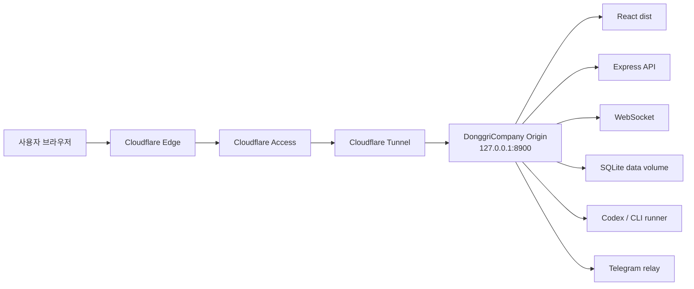

# 설계 명세서: Cloudflare Access 기반 DonggriCompany 원격 운영

작성일: 2026-04-29
대상: DonggriCompany 외부 접속/명령 실행 구조
설계 상태: 초안

## 1. 설계 목표

목표는 외부에서 접속 가능한 개인 전용 운영 대시보드를 만드는 것이다.

핵심 설계 원칙:

```text
Cloudflare는 인증/터널/접속 제어 담당
DonggriCompany는 실제 업무 실행 담당
secret과 runner는 로컬에 유지
외부 도메인은 인증된 사용자 1명만 접근
```

## 2. 논리 아키텍처



## 3. 요청 흐름

### 3.1 대시보드 접속

```text
GET https://donggri-company.<도메인>/
-> Cloudflare Access policy 평가
-> 허용 이메일이면 Access token 발급
-> Tunnel로 origin 전달
-> Express static dist/index.html 반환
```

### 3.2 API session bootstrap

```text
GET /api/auth/session
-> Access 인증 통과
-> DonggriCompany trusted origin 확인
-> claw_session HttpOnly cookie 발급
-> csrf_token 반환
```

설계 조건:

```text
ALLOWED_ORIGINS=https://donggri-company.<도메인>
SESSION_COOKIE_NAME=claw_session
SameSite=Strict
Secure=true
```

### 3.3 mutation 요청

```text
POST /api/directives 또는 /api/tasks
-> Access 인증 통과
-> 앱 session cookie 또는 Bearer token 확인
-> CSRF token 확인
-> DB 저장
-> workflow/runner 처리
```

### 3.4 WebSocket

```text
wss://donggri-company.<도메인>/
-> Access 인증 통과
-> 앱 cookie 인증 확인
-> WebSocket connected
-> task/message/status event 수신
```

### 3.5 Telegram receiver

```text
Telegram Bot API getUpdates
-> server/messenger/telegram-receiver.ts
-> 허용 chat id 확인
-> http://127.0.0.1:<PORT>/api/inbox
-> x-inbox-secret 검증
-> directive/task/chat 처리
```

이 흐름은 외부 inbound가 없어도 동작한다.

## 4. 인증 계층

| 계층 | 목적 | 구현 |
| --- | --- | --- |
| Cloudflare Access | 외부 접근자 제한 | 이메일/IdP/MFA/device 조건 |
| DonggriCompany session | 앱 내부 API 인증 | `claw_session`, `API_AUTH_TOKEN` |
| CSRF | 인증 브라우저 mutation 보호 | `x-csrf-token` |
| Inbox secret | 외부 command webhook 보호 | `x-inbox-secret` |
| Project path gate | 임의 경로 실행 방지 | project binding/path policy |
| Runner auth | Codex/CLI 실행 인증 | local multi-auth read-only mount |

## 5. Trust boundary

```text
Internet
  -> Cloudflare Access까지는 비신뢰 영역
Cloudflare Access 인증 후
  -> 사용자 인증 통과 영역
Tunnel 내부
  -> 네트워크 전달 영역
DonggriCompany app
  -> 업무 권한/명령 실행 영역
Local runner/filesystem
  -> 고위험 실행 영역
```

고위험 경계:

```text
/api/tasks/:id/run
/api/tasks/:id/inject
/api/directives
/api/inbox
project_path 접근
Codex multi-auth mount
OAuth token storage
```

## 6. 데이터 설계

### 6.1 저장 데이터

```text
SQLite DB:
  projects
  tasks
  messages
  settings
  oauth runtime metadata
  audit/security logs

data/logs:
  task logs
  messenger relay logs
  runner logs
```

### 6.2 외부로 나가면 안 되는 데이터

```text
.env
SQLite DB 원본
Codex multi-auth storage
OAuth access/refresh token
Telegram Bot Token
INBOX_WEBHOOK_SECRET
API_AUTH_TOKEN
OAUTH_ENCRYPTION_SECRET
cloudflared credentials JSON
```

## 7. Cloudflare 정책 설계

### 7.1 Access application

```text
Type: Self-hosted
Domain: donggri-company.<도메인>
Session Duration: 8h
IdP: Google 또는 One-time PIN
```

### 7.2 Allow policy

```text
Action: Allow
Include: Email == <내 이메일>
Require: MFA 또는 Country == KR 선택
Exclude: 없음 또는 명시 차단 계정
```

### 7.3 금지 정책

```text
Bypass: 사용 금지
Include Everyone: 사용 금지
Emails ending in public domain only: 사용 금지
```

Cloudflare 공식 문서 기준 Bypass는 Access 보안 제어와 로깅을 적용하지 않으므로 운영 관리자 콘솔에 쓰지 않는다.

## 8. Runtime 설계

### 8.1 Docker

```text
Service: donggricompany
Port: 8900
HOST: 0.0.0.0
DB_PATH: /app/data/claw-empire.sqlite
LOGS_DIR: /app/data/logs
OFFICE_RUNNER_DOCKER_ENABLED: 0
Codex multi-auth: read-only mount
```

### 8.2 필수 environment

```text
API_AUTH_TOKEN=<random>
INBOX_WEBHOOK_SECRET=<random>
OAUTH_ENCRYPTION_SECRET=<random>
ALLOWED_ORIGINS=https://donggri-company.<도메인>
ALLOWED_ORIGIN_SUFFIXES=.ts.net
OAUTH_BASE_URL=https://donggri-company.<도메인>
```

## 9. 장애 모드

| 장애 | 증상 | 대응 |
| --- | --- | --- |
| PC 종료 | 외부 접속 실패 | PC 부팅, Docker/cloudflared 재시작 |
| Docker 중지 | Access 후 502/connection refused | `docker compose up -d` |
| cloudflared 중지 | 외부 도메인 접속 실패 | `cloudflared tunnel run` 또는 service 재시작 |
| Access policy 오류 | 본인도 접속 불가 | Cloudflare Dashboard에서 policy 수정 |
| ALLOWED_ORIGINS 누락 | `/api/auth/session` 401 | `.env`/compose env 수정 후 재배포 |
| WebSocket 실패 | 실시간 상태 미반영 | cookie/Access/WebSocket proxy 확인 |
| runner 인증 실패 | task 실행 실패 | Codex auth/multi-auth mount 확인 |

## 10. 보안 설계 결정

1. Cloudflare Access 없이 tunnel을 공개하지 않는다.
2. Cloudflare Bypass를 쓰지 않는다.
3. Cloudflare Service Auth는 브라우저 대시보드에는 쓰지 않는다. 기계 간 API가 필요할 때만 별도 endpoint에 검토한다.
4. origin은 `127.0.0.1:8900`을 기본으로 한다.
5. secret은 문서화하지 않고 존재 여부와 저장 위치만 기록한다.
6. 내부 앱 인증을 Access로 대체하지 않는다. Access는 1차 관문이고 앱 auth가 2차 관문이다.

## 11. 확장 설계

2차 기능:

```text
Telegram Web App Quick Command
Cloudflare Access 로그 정기 리뷰
자동 health monitor
Windows service 자동 재시작
WARP/device posture 기반 장비 제한
```

3차 기능:

```text
Cloudflare Terraform/IaC
Access policy drift detection
Audit evidence 자동 수집
ISO 9001 internal audit checklist 자동 생성
```
