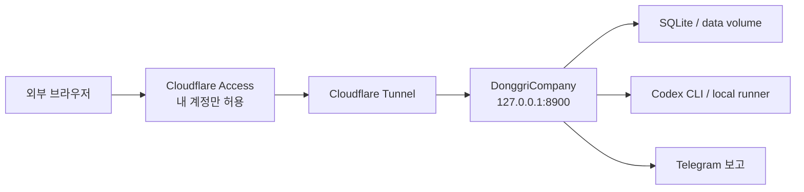
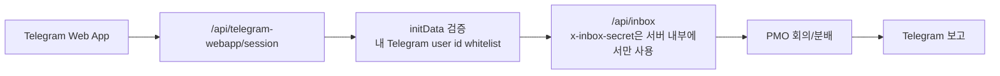

# DonggriCompany 외부 접속/개인 전용 운영 전략 보고서

작성일: 2026-04-29

## 결론

최적안은 전체 대시보드를 `Cloudflare Tunnel + Cloudflare Access` 뒤에 두는 방식이다.

Telegram Web App은 전체 대시보드 대체가 아니라 모바일에서 빠르게 지시를 넣는 보조 UI로 쓰는 편이 맞다. Webhook-only는 대시보드 호스팅 방식이 아니라 `$`, `#` 명령을 받아 `/api/inbox`로 넣는 명령 입력 채널이다.

권장 순서:

1. 전체 관리자 대시보드: Cloudflare Tunnel + Cloudflare Access
2. 내 장비만 붙일 수 있으면: Tailscale Serve
3. 모바일 빠른 명령: Telegram Web App
4. 텍스트 명령 백업 채널: Telegram receiver/webhook-only

## 현재 코드 기준 사실

DonggriCompany는 단순 정적 웹앱이 아니다. 서버가 DB, runner, OAuth, Telegram relay, WebSocket, task execution을 같이 들고 있다.

확인한 근거:

- `package.json`: `dev:local`은 Web `127.0.0.1:8800`, API `127.0.0.1:8790`로 실행한다.
- `docker-compose.yml`: 운영 컨테이너는 `PORT=8900`, `HOST=0.0.0.0`, `8900:8900`으로 실행한다.
- `server/config/runtime.ts`: 기본 `HOST=127.0.0.1`, 기본 `PORT=8790`, `ALLOWED_ORIGIN_SUFFIXES` 기본값은 `.ts.net`이다.
- `server/security/auth.ts`: 일반 API는 `Authorization: Bearer <API_AUTH_TOKEN>` 또는 session cookie가 필요하고, `/api/inbox`는 public path지만 별도 `x-inbox-secret`을 검증한다.
- `server/modules/routes/ops/messages/directives-inbox-routes.ts`: `/api/inbox`는 `INBOX_WEBHOOK_SECRET` 없으면 503, secret 불일치면 401, `$` prefix면 CEO directive로 처리한다.
- `server/messenger/telegram-receiver.ts`: 현재 Telegram receiver는 `getUpdates` polling 방식으로 허용된 chat id의 메시지를 로컬 `/api/inbox`로 forward한다.
- `server/modules/lifecycle.ts`: production에서는 `dist/`를 같은 Express 서버에서 serving하고, 같은 HTTP 서버 위에 WebSocket을 붙인다.

즉, 대시보드만 Vercel/정적 호스팅에 올리면 명령 실행은 안 된다. 브라우저가 실제 DonggriCompany API 서버, DB, runner가 있는 원본 서버에 닿아야 한다.

## 선택지 비교

| 방식 | 외부 접속 | 나만 접속 | 전체 대시보드 | 명령 실행 | 판단 |
| --- | --- | --- | --- | --- | --- |
| Cloudflare Tunnel + Access | 가능 | 가능 | 적합 | 가능 | 최우선 |
| Tailscale Serve | tailnet 내부 가능 | 가능 | 적합 | 가능 | 장비 전용이면 최상 |
| Tailscale Funnel | 공개 인터넷 가능 | 앱 인증 추가 필요 | 가능 | 가능 | 비권장 |
| Telegram Web App | Telegram 안에서 가능 | user id 검증 필요 | 제한적 | 가능 | 보조 UI |
| Telegram webhook/receiver only | 가능 | bot/chat/user 제한 필요 | 불가 | 가능 | 명령 채널 |
| 일반 VPS에 전체 이식 | 가능 | 직접 구현 필요 | 가능 | 환경 재구성 필요 | 비권장 |

## 권장 아키텍처



핵심 원칙:

- 공유기 포트포워딩으로 `8790` 또는 `8900`을 직접 열지 않는다.
- 공개 도메인 앞단은 Cloudflare Access가 먼저 막는다.
- 앱 내부도 `API_AUTH_TOKEN`, session cookie, CSRF, `INBOX_WEBHOOK_SECRET`을 유지한다.
- 명령 실행은 로컬/컨테이너 runner가 있는 DonggriCompany 서버에서만 수행한다.
- `.env`, OAuth token, Codex multi-auth 저장소는 외부 호스팅 서비스에 올리지 않는다.

## Cloudflare Tunnel + Access 권장 이유

Cloudflare Tunnel은 로컬 origin을 public hostname에 연결하되 inbound port를 열지 않는다. Cloudflare 공식 문서도 tunnel이 outbound-only 연결로 동작하고 public hostname을 local service에 매핑한다고 설명한다.

Cloudflare Access self-hosted app 문서는 tunnel route를 만들기 전에 Access application을 먼저 만들라고 권장한다. Access application이 없으면 published app이 인터넷 전체에 열릴 수 있기 때문이다.

DonggriCompany에 맞는 이유:

- 전체 React dashboard, API, WebSocket을 같은 origin으로 보호할 수 있다.
- 집 밖 브라우저에서도 접속 가능하다.
- 내 이메일/SSO/OTP 계정만 허용할 수 있다.
- 로컬 DB와 Codex runner는 PC/컨테이너에 그대로 둔다.
- Telegram Web App보다 관리자 콘솔 전체를 보호하기 쉽다.

구성:

```text
https://donggri-company.example.com
  -> Cloudflare Access
  -> Cloudflare Tunnel
  -> http://127.0.0.1:8900
```

Access policy:

```text
Allow:
  email == <내 이메일>

Deny:
  everyone else
```

## Docker 운영 기준 실행 절차

운영은 Docker 기준이 가장 안정적이다. 현재 `docker-compose.yml`은 host `8900`으로 열리므로 Cloudflare Tunnel target도 `127.0.0.1:8900`으로 잡는다.

### 1. 환경변수 준비

`.env`에 최소값을 둔다. 실제 값은 긴 랜덤 문자열로 넣고 문서/채팅에 출력하지 않는다.

```powershell
Set-Location "D:\Donggri_Platform\DonggriCompany"

$apiToken = [Convert]::ToHexString([Security.Cryptography.RandomNumberGenerator]::GetBytes(32)).ToLower()
$inboxSecret = [Convert]::ToHexString([Security.Cryptography.RandomNumberGenerator]::GetBytes(32)).ToLower()
$oauthSecret = [Convert]::ToHexString([Security.Cryptography.RandomNumberGenerator]::GetBytes(32)).ToLower()

@"
API_AUTH_TOKEN=$apiToken
INBOX_WEBHOOK_SECRET=$inboxSecret
OAUTH_ENCRYPTION_SECRET=$oauthSecret
ALLOWED_ORIGINS=https://donggri-company.example.com
OAUTH_BASE_URL=https://donggri-company.example.com
"@ | Set-Content -Path ".\.env" -Encoding UTF8
```

주의: 현재 `docker-compose.yml`은 `ALLOWED_ORIGINS`를 container environment에 넘기지 않는다. Docker로 외부 도메인을 쓸 경우 아래 항목을 service environment에 추가해야 한다.

```yaml
ALLOWED_ORIGINS: ${ALLOWED_ORIGINS:-}
ALLOWED_ORIGIN_SUFFIXES: ${ALLOWED_ORIGIN_SUFFIXES:-.ts.net}
```

### 2. 서버 실행

```powershell
Set-Location "D:\Donggri_Platform\DonggriCompany"
docker compose up -d --build
docker compose ps
Invoke-RestMethod -Uri "http://127.0.0.1:8900/api/health" | ConvertTo-Json -Compress
```

### 3. Cloudflare Tunnel 설치 및 연결

아래는 Windows PowerShell 기준 템플릿이다. `<TUNNEL_ID>`와 도메인은 실제 값으로 바꾼다.

```powershell
winget install --id Cloudflare.cloudflared

cloudflared tunnel login
cloudflared tunnel create donggri-company
cloudflared tunnel route dns donggri-company donggri-company.example.com

New-Item -ItemType Directory -Force "$env:USERPROFILE\.cloudflared" | Out-Null

@"
tunnel: <TUNNEL_ID>
credentials-file: C:\Users\<WINDOWS_USER>\.cloudflared\<TUNNEL_ID>.json

ingress:
  - hostname: donggri-company.example.com
    service: http://127.0.0.1:8900
  - service: http_status:404
"@ | Set-Content -Path "$env:USERPROFILE\.cloudflared\config.yml" -Encoding UTF8

cloudflared tunnel run donggri-company
```

그 다음 Cloudflare Zero Trust Dashboard에서:

```text
Access -> Applications -> Add an application -> Self-hosted
Application domain: donggri-company.example.com
Policy: Include email == <내 이메일>
```

이 순서를 지킨다. Access application 없이 tunnel DNS만 먼저 열면 공개 노출 위험이 생긴다.

## Tailscale Serve 대안

내 노트북/폰/태블릿에 Tailscale 설치가 가능하고, public 도메인이 꼭 필요 없다면 Tailscale Serve가 더 단순하다.

공식 문서 기준으로 Tailscale Serve는 tailnet 내부 장비에서만 로컬 서비스를 볼 수 있게 한다. 반대로 Funnel은 인터넷 전체에 공개하는 기능이다.

실행:

```powershell
Set-Location "D:\Donggri_Platform\DonggriCompany"
docker compose up -d --build
Invoke-RestMethod -Uri "http://127.0.0.1:8900/api/health" | ConvertTo-Json -Compress

tailscale serve --bg 8900
tailscale serve status
```

장점:

- public internet에 관리자 콘솔을 노출하지 않는다.
- tailnet ACL로 내 계정/장비만 제한하기 쉽다.
- `ALLOWED_ORIGIN_SUFFIXES=.ts.net` 기본값과 현재 코드 구조가 잘 맞는다.

단점:

- 접속할 모든 장비에 Tailscale 로그인이 필요하다.
- 일반 브라우저에서 URL만 받아 접속하는 구조는 아니다.

## Tailscale Funnel은 비권장

Funnel은 broader internet에서 로컬 서비스를 접속하게 해준다. Tailscale 공식 문서도 Serve는 tailnet 내부용, Funnel은 public internet 공유용으로 구분한다.

DonggriCompany에는 기본 비권장이다.

이유:

- public endpoint가 생긴다.
- "나만 접속"은 앱 내부 인증만으로 버티게 된다.
- 설정 실수 시 관리자 콘솔이 외부에 노출된다.
- Cloudflare Access처럼 명확한 self-hosted app 정책을 앞단에 세우기 어렵다.

## Telegram Web App 분석

Telegram Web App은 "Telegram 안에서 열리는 HTTPS 웹 UI"다. Telegram 공식 문서는 `Telegram.WebApp.initData`를 서버로 보내 검증하라고 설명하고, `initDataUnsafe`는 신뢰하지 말라고 경고한다.

가능한 기능:

- 최근 프로젝트 선택
- `$` CEO 지시 입력
- `skipPlannedMeeting` 선택
- 진행 상태 요약
- 최근 보고서 확인
- Telegram user id whitelist 기반 개인 접근

부적합한 기능:

- 전체 dashboard 대체
- Agent Manager 전체 편집
- OAuth/Codex multi-auth 관리
- raw terminal/log/worktree inspector
- 복잡한 review/merge UI

권장 구조:



중요 규칙:

- Telegram Web App도 결국 HTTPS hosting이 필요하다.
- bot token과 `INBOX_WEBHOOK_SECRET`은 브라우저에 절대 내려주지 않는다.
- `initData`는 서버에서 HMAC 검증한다.
- 검증된 Telegram user id가 내 id가 아니면 403 처리한다.
- Web App은 "Quick Command"로만 만든다.

## Webhook-only 분석

Webhook-only 또는 현재 polling receiver는 대시보드 호스팅 방식이 아니다. 명령을 넣는 통로다.

현재 코드에서는 Telegram receiver가 Bot API `getUpdates` polling으로 메시지를 받고, 허용된 chat id만 `/api/inbox`로 forward한다. 외부에서 내 PC로 inbound를 열지 않아도 Telegram 명령 입력은 가능하다.

가능:

```text
$이 프로젝트의 UI를 더 깔끔하게 정리해줘
#QA 회귀 테스트 등록
```

불가능:

- 전체 dashboard 보기
- task detail 조작
- Agent/OAuth/settings 관리
- terminal log 긴 흐름 확인

따라서 webhook-only는 계속 유지하되, "밖에서 대시보드 보기" 문제의 해답은 아니다.

## 명령 실행 가능 여부

외부 접속 방식과 무관하게 아래 조건이 맞으면 명령 실행은 가능하다.

- 브라우저 요청이 실제 DonggriCompany 서버까지 도달한다.
- production build가 같은 Express 서버에서 serving된다.
- WebSocket도 같은 origin으로 연결된다.
- 원격 origin이 `ALLOWED_ORIGINS` 또는 trusted suffix에 포함된다.
- `API_AUTH_TOKEN` 또는 session cookie 인증이 통과한다.
- mutation 요청은 CSRF 조건을 만족한다.
- `/api/inbox` 사용 시 `x-inbox-secret`이 서버 내부에서만 붙는다.
- task에 `project_id`와 `project_path`가 바인딩된다.
- Docker/host가 해당 project path와 runner에 접근 가능하다.
- Codex multi-auth mount가 read-only 정책대로 연결되어 있다.

반대로 아래 구조에서는 명령 실행이 깨진다.

- 정적 dashboard만 외부 호스팅하고 API는 로컬 `127.0.0.1` 그대로 둠
- Cloudflare Access 없이 tunnel만 public DNS에 연결
- `ALLOWED_ORIGINS` 미설정으로 `/api/auth/session`이 원격 도메인을 신뢰하지 않음
- Telegram Web App 브라우저에 `INBOX_WEBHOOK_SECRET`을 내려줌
- VPS에 UI만 올리고 로컬 runner/DB/worktree 접근 경로가 없음

## 보안 체크리스트

- 공유기 포트포워딩 금지
- Cloudflare Access 또는 Tailscale 인증 필수
- `API_AUTH_TOKEN` 긴 랜덤값 사용
- `INBOX_WEBHOOK_SECRET` 긴 랜덤값 사용
- `OAUTH_ENCRYPTION_SECRET` 긴 랜덤값 사용
- `.env`, SQLite DB, token storage commit 금지
- Cloudflare custom domain은 `ALLOWED_ORIGINS`에 추가
- Tailscale만 쓸 경우 `.ts.net` suffix 유지
- Telegram Web App은 `initData` 서버 검증 필수
- Telegram user id whitelist 필수
- bot token과 inbox secret은 browser에 노출 금지
- `/api/docs` 공개 필요 없으면 Access 뒤에만 둠
- 로그에 token/OAuth code 출력 금지

## 최종 실행 계획

1. `docker-compose.yml`에 `ALLOWED_ORIGINS`, `ALLOWED_ORIGIN_SUFFIXES` environment pass-through 추가
2. `.env`에 `API_AUTH_TOKEN`, `INBOX_WEBHOOK_SECRET`, `OAUTH_ENCRYPTION_SECRET`, `ALLOWED_ORIGINS`, `OAUTH_BASE_URL` 설정
3. Docker production 서버를 `127.0.0.1:8900`에서 health check
4. Cloudflare Access self-hosted application 먼저 생성
5. Cloudflare Tunnel을 `http://127.0.0.1:8900`으로 연결
6. 외부 브라우저에서 Access 로그인 후 dashboard/API/WebSocket smoke
7. Telegram Web App은 별도 "Quick Command" 기능으로 후순위 구현
8. 현재 Telegram receiver는 백업 명령 채널로 유지

## 의사결정

DonggriCompany 전체 대시보드는 Cloudflare Tunnel + Cloudflare Access로 운영한다.

Telegram Web App은 전체 대시보드 대체가 아니라 모바일 명령/상태 확인용 보조 화면으로 만든다.

Webhook-only는 Telegram 그룹에서 `$`, `#` 명령을 받는 백업 입력 채널로 유지한다.

## 참고 자료

- [Telegram Mini Apps 공식 문서](https://core.telegram.org/bots/webapps)
- [Cloudflare Tunnel 공식 문서](https://developers.cloudflare.com/tunnel/)
- [Cloudflare Access self-hosted app 공식 문서](https://developers.cloudflare.com/cloudflare-one/applications/configure-apps/self-hosted-apps/)
- [Tailscale Serve 공식 문서](https://tailscale.com/docs/features/tailscale-serve)
- [Tailscale Funnel 공식 문서](https://tailscale.com/kb/1223/funnel)
